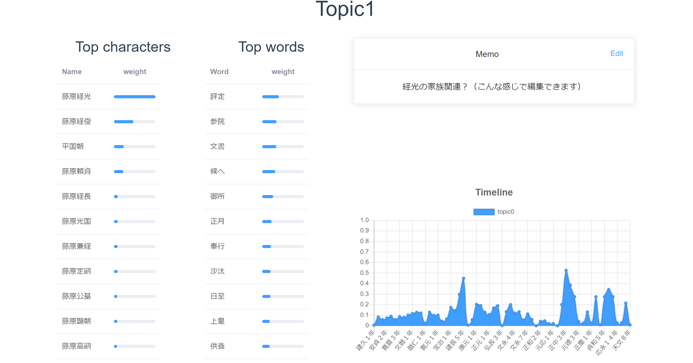
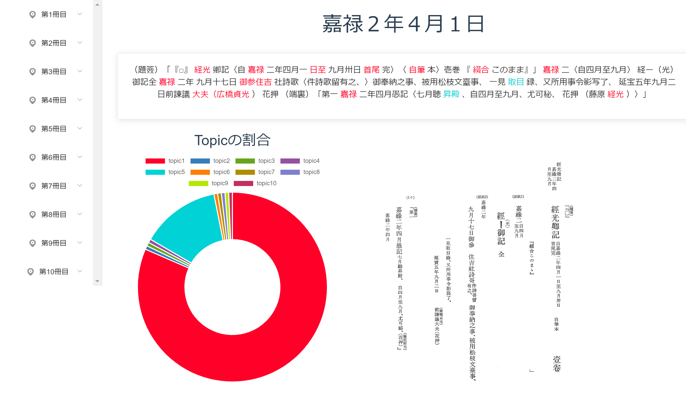
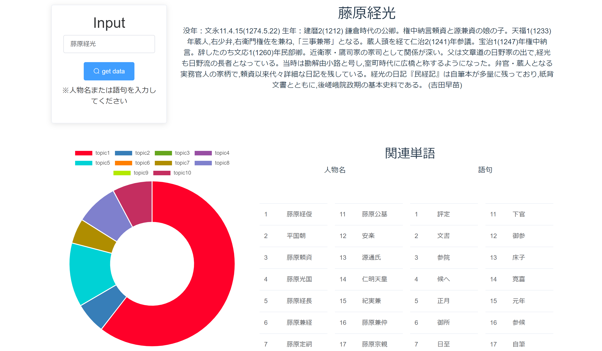
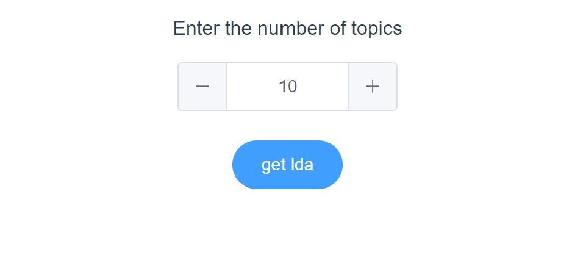
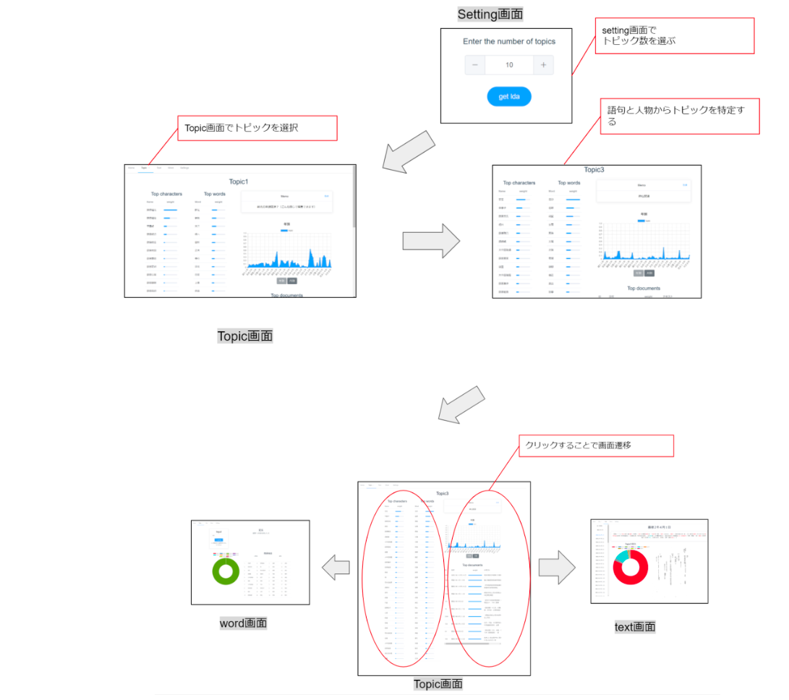
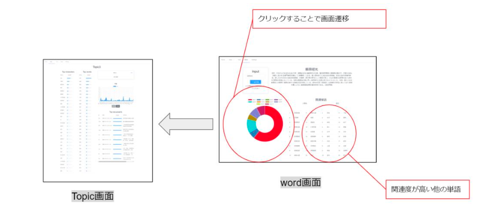

# LDA_minkeiki_app

## はじめに

このアプリは卒業論文及び情報処理学会発表用に作成したアプリケーションのデモとなります。
研究テーマは「日本史学者の要求分析に基づく歴史資料のトピック分析システムの開発」です。
権利のため、『民経記』のすべてを公開することができず、Text画面は一部（デモ）となります。
また、backend/data以下のファイルに関しては開発者にお問い合わせください。

## 研究概要

この研究では、要求分析の結果に基づき、日本史研究者の史料群に対する有用性及びわかりやすさ、分析システムの低コストでの利用という要求を満たす要件を定義しました。鎌倉中期の公家である藤原（勘解由小路）経光が記した『民経記』を対象に、ルールベースにより抽出した人名及びn-gram分割により本文から抽出した単語とその頻度からbag-of-wordsを生成し、LDA(Latent Dirichlet Allocation)を適用することでトピックを推定した。また、トピックを特徴づける単語を選定し、その単語により史料の参照を容易にし、定義した要求を満たすユーザーインターフェースを開発し、azure上で動くWebApplicationを開発し、日本史学者による定性的な評価を行った。


# リンク
開発したアプリケーションのリンクはこちら
[https://minkeiki-app.azurewebsites.net/](https://minkeiki-app.azurewebsites.net/)

また、「大日本古記録民経記」に関する概要は、東京大学史料編纂所が刊行しているこちらのサイトから閲覧することができる。
[https://www.hi.u-tokyo.ac.jp/publication/syoho/10/pub_kokiroku-minkeiki-01.html](https://www.hi.u-tokyo.ac.jp/publication/syoho/10/pub_kokiroku-minkeiki-01.html)

情報処理学会　全国大会講演リンクはこちら
[https://www.ipsj.or.jp/event/taikai/83/ipsj_web2021/data/pdf/2ZC-05.html](https://www.ipsj.or.jp/event/taikai/83/ipsj_web2021/data/pdf/2ZC-05.html)

# docker立ち上げ
vueのパッケージインストール
※node_modulesとyarn.lockがない状態か確認
```
docker-compose run vue yarn
```

vueとflaskのbuild
```
docker-compose build
```

docker立ち上げ
```
docker-compose up vue
```

# 使用方法

## 各画面について
アプリケーションにはメインの機能が備わっている画面として、Topic画面、Text画面、Word画面があります。

## Topic画面

Topic画面では、各トピックの情報を見ることができます。
画面の左側では、トピックに関連度が高い語句と人名の上位30を確認できます。単語をクリックすると単語画面に遷移し、詳しい情報を見ることができます。
右のMemo機能では、そのトピックに関して気づいたことをメモすることができます。「edit」ボタンで編集することができます。
時系列変化では、トピックの割合が高い年代または月を見ることができます。「年別」「月別」をクリックすることで切り替えることが可能です。
Top documentsではトピックの割合が高い日記を確認することができ、クリックすることで遷移します。




## Text画面

※権利のため一般向けには使用することができません。以下、日本史学者用に提供した機能の説明をします。
左のサイドバーから見たい日記を選択します。サイドバーは「大日本古記録民経記」の刊行順になっており、またその中で日付順に並べられています。
日記を選択すると、日記情報を確認することができます。
色がついているテキスト情報では（画面上部）、日記中の単語のうち、Bag-of-Wordsに選定されたものと、LDAの結果として得られたその単語のトピックを見ることができます。グラフをクリックすると、クリックしたトピック情報に遷移することができます。
その下には、表示している日記のトピックの割合と、実際のテキストを見ることができます。



## Word画面

Word画面では、LDAを実行する時にBag-of-Wordsに含めた単語の情報を見ることができます。Inputで調べたい単語を入力します（例：藤原経光）。右上ではコトバンクにその言葉がある場合情報を取得し表示します。
左下では表示している単語のトピックの割合を表示しています（クリックで遷移することができます）。
また右下では、その単語と関連度が高い人物または単語を表示しています。クリックすることでその単語の情報を確認することができます。



## Setting画面

設定画面では、トピック数を変更することができます。
表示したいトピック数を入力し、[get lda]をクリックすると全画面が更新されます。
この画面があるのは、教師なし学習の手法で定量的な評価ができないLDAにおいて重要な機能であり、Coherenceなどで一定の数値評価はできるものの、トピック数を変化させ情報を分析する作業はユーザーに一任しているからです。
将来的にはLDAの設定（Iteration数などのパラメータ）を設定できるようにする予定です。



## 想定される具体的な使用方法

開発したシステムはユーザーとして日本史学者を想定しているが、日本史学者の中でも、対象とする史料を専門家とするかどうかで使用法は異なります。
史料を専門とする日本史学者は、可視化された分析結果を確認し、また新たな知見や研究材料を詮索するために、Web Applicationの画面をユーザーの赴くままに横断し、分析結果を考察する。この使用方法を使用方法1とします。
史料を専門としない日本史学者は、その史料を読む動機としてはその史料の中に調べたい情報が存在し、その情報を効率よく見つけるために Web Application を使用します。そのため、目的に応じて使用する画面は異なる。この使用方法を使用方法2とします。

1. 調べたいと思った内容について、トピック数やトピックを変化させながら、トピックに属する語句と人 物を確認し、その内容に関するトピックを特定する。特定されたトピックに関連度が高い文章または、 時系列変化から読み取った関連度が高い年代の文章を読む。
2. 調べたいと思った人物について、そのトピックを特定し、トピックに属する他の人名や単語を考察す る。また、そのトピックと関連度が高い文章や年代を調べる。

使用方法１

使用方法２

